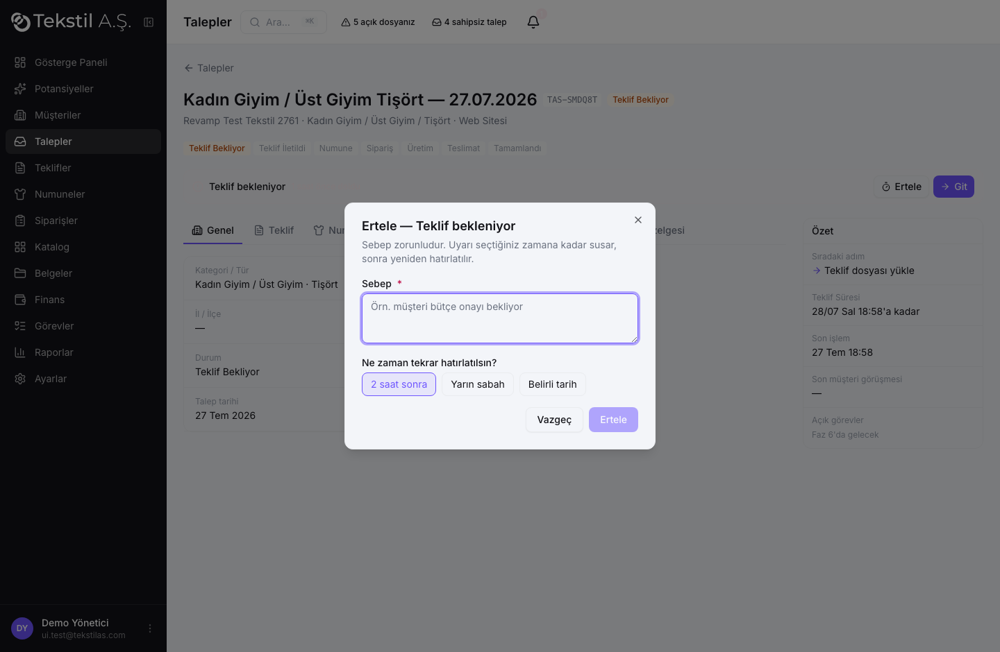
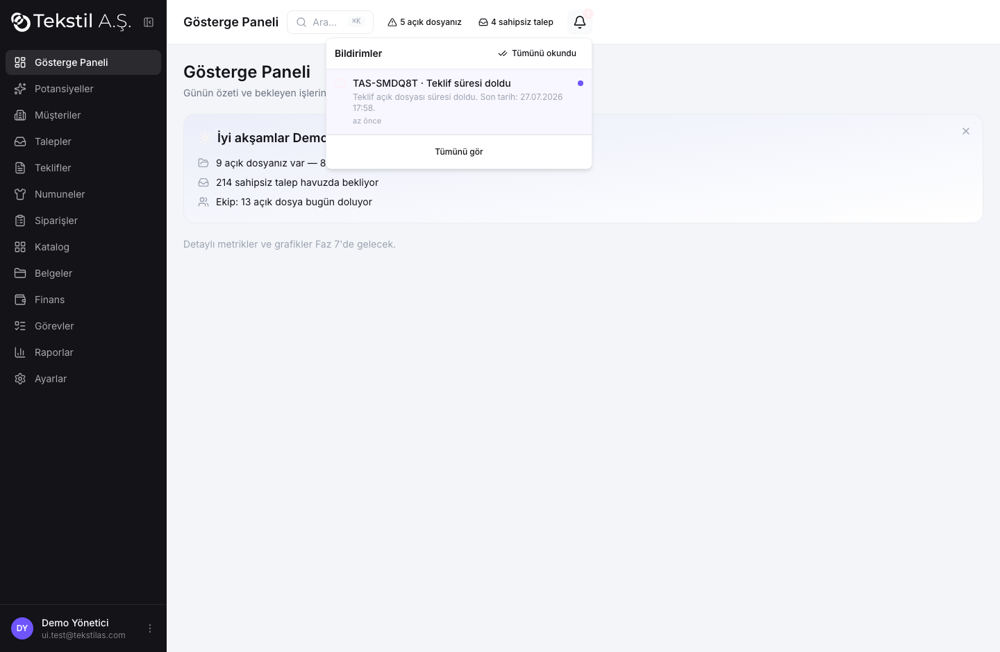
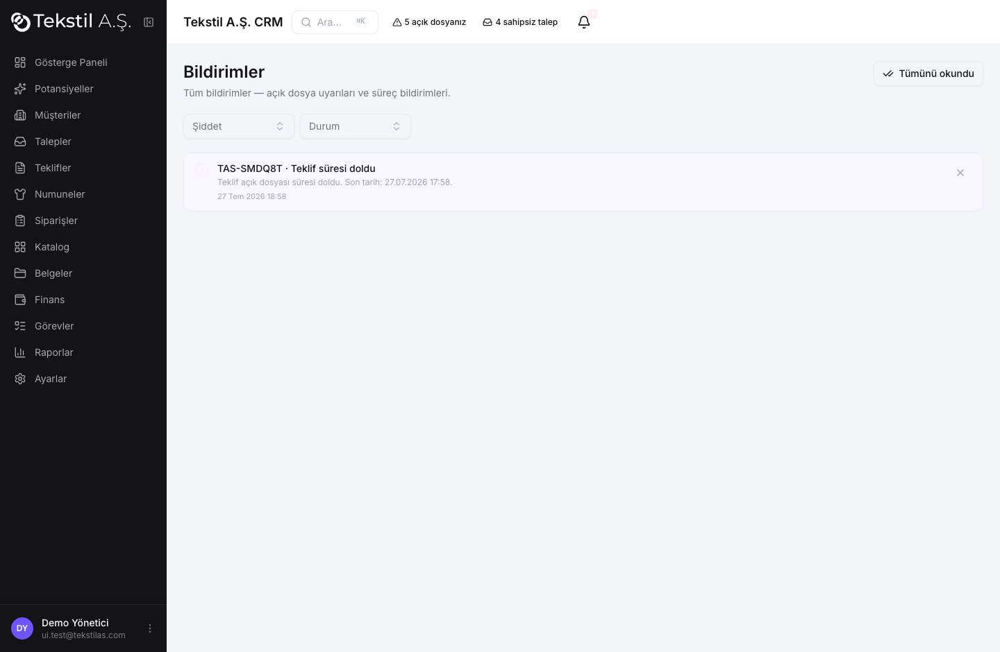
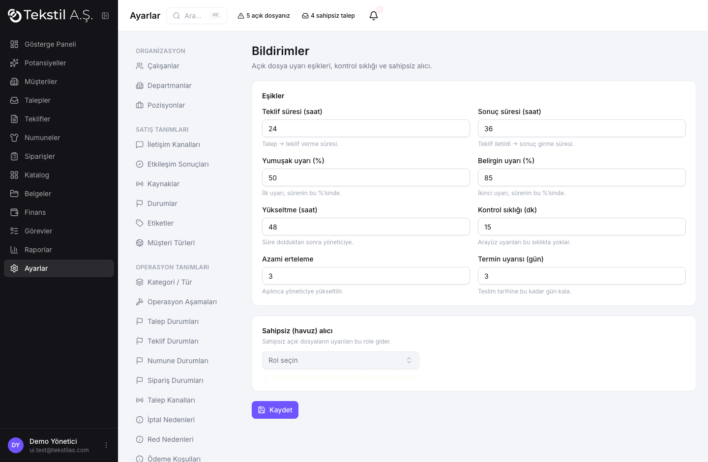
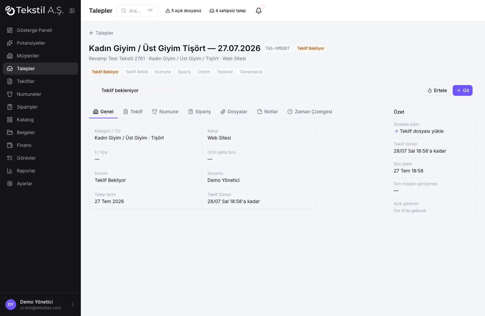
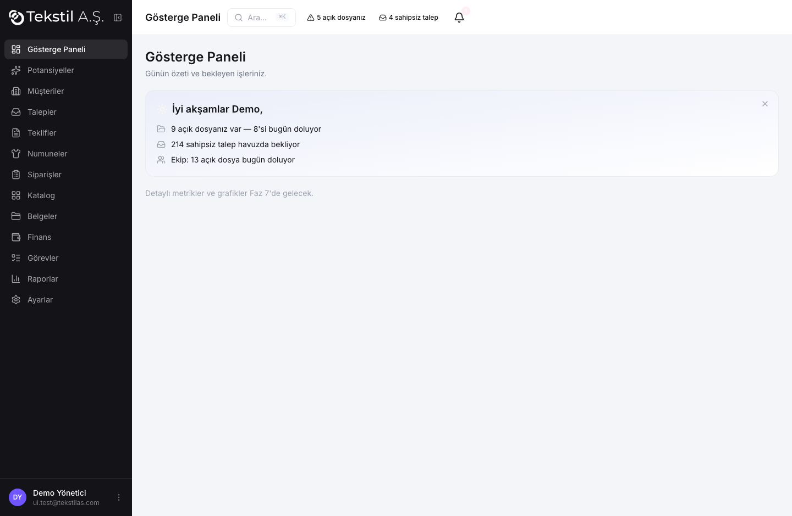

# Bildirim ve Hatırlatma Sistemi (Faz 4B-bildirim)

Sistem artık kayıt tutmakla kalmıyor, **takip ediyor ve uyarıyor**. Merkezinde iş sahibinin
"açık dosya" kavramı var: takip edilen, süre içinde kapanması gereken iş kalemleri.

## Açık dosya modeli (B.1)

`open_files` — operasyon başına tip başına tek AÇIK dosya. Süreler **takvim saatiyle**, eşikler
`settings.alerts.*`'ten. Açılış/kapanış tümü **trigger** ile (elle müdahale yok):

| Olay | Sonuç |
|---|---|
| Talep oluştu | `teklif_bekleniyor` açılır (due = talep + 24s) |
| Teklif üretildi | teklif_bekleniyor kapanır, `sonuc_bekleniyor` açılır (due = +36s) |
| Teklif silindi (A8) | geri döner |
| Sonuç girildi | sonuc_bekleniyor kapanır |
| Olumlu — Beklemede (H6) | `olumlu_beklemede` açılır, **due = tekrar-bak tarihi** |
| Operasyon iptal | tüm dosyalar kapanır |

`teklif_bekleniyor` **elle kapatılamaz** — yalnızca teklif üretilince kapanır (Kabul 3).

## Kademeli uyarı motoru (B.2)

`process_open_file_alerts()` okuma anında (cron yok) çalışır; arayüz `alerts.check_interval_minutes`
aralıkla çağırır. Dört kademe, her biri **bir kez** (`last_level`), yarış-güvenli:

| Kademe | Ne zaman | Şiddet | Kim |
|---|---|---|---|
| 1 Yumuşak | %50 | bilgi | sorumlu |
| 2 Belirgin | %85 | uyarı | sorumlu |
| 3 Süre doldu | %100 | kritik | sorumlu + ayardan |
| 4 Yükseltme | due + 48s | kritik | yönetici |

Sahipsiz dosyalar `alerts.pool_recipients`'e gider; biri **üstlenince diğerlerinin bildirimi kapanır**.

## Erteleme (B.3)

Her uyarıda **Ertele** (sebep + zaman) ve **Git** (işi yapmaya götür). Sebep **zorunlu** (DB `check`).
Erteleme bitince uyarı **mevcut kademeyle bir kez yeniden hatırlatır**. "N. kez ertelendi" ve geçmiş
dosyada durur; azami (`alerts.max_snooze_count`=3) aşılınca **yöneticiye yükseltilir**.

## Bildirim merkezi + ses (B.4/B.5)

Üst çubukta **zil** + okunmamış sayısı; panel kronolojik, şiddet renk/ikon, tıkla → kayda gider;
"Tümünü okundu"; ayrı **Bildirimler** sayfası (filtre). **Gerçek zamanlı** (Supabase realtime).

Ses: yalnızca **yeni** ve önemli olayda (realtime INSERT → sayfa yenilemede/tekrar çalmaz); kademeye
göre farklı ton (bilgi tek ton, kritik iki ton); profilde aç/kapa + eşik; tarayıcı izni ilk
etkileşimde; ses dosyaları **yerel** (`public/sounds`).

## Ayarlar (B.6)

**Ayarlar → Bildirimler** (owner/admin): eşikler, kontrol sıklığı, azami erteleme, termin uyarısı,
sahipsiz (havuz) alıcı. Profilde ses tercihi.

## Gösterge (B.7)

Üst çubuk rozetleri **open_files**'a bağlı (bana ait süresi dolan/dolacak + sahipsiz).
Operasyon kartında **açık dosya bandı**: kalan süre + Ertele/Git + erteleme geçmişi.

## Süreç bildirimleri (B.8)

| Bildirim | Tetik | Ses |
|---|---|---|
| Yeni talep | operations INSERT | Yok |
| Bilinen müşteriden talep | 30g içinde 2. talep | Var |
| İş atandı | owner set (başkası) | Var |
| Numune kargoda / teslim | sample status | Yok / Var |
| Termin yaklaşıyor | promised − 3g | Var |
| Ön ödemesiz üretim | order → uretimde, ödeme yok | Var |
| 3. numune revizyonu | revision_round ≥ 3 | Var |

`notifications.silent` bayrağı sesi kontrol eder. Görev bildirimleri **YOK** (Faz 6); `type` açık kalır.

## Günlük özet (B.9)

Gösterge Paneli üstünde, günde bir üretilen, kapatılabilir özet. Yalnızca **eylem gerektiren**
kalemler; boş gün açıkça söylenir (uydurma satır yok); satırlar tıklanabilir; yönetici ek ekip özeti.
Ses yok.

## Kabul kriterleri

DB-düzeyi doğrulandı (trigger/motor/erteleme): 1–12, 17. Arayüzden doğrulandı: 13–16, 18, 26–29 ve
süreç bildirimleri (19–25) tetikleyicileri kuruldu. Testler: `scripts/test-bildirim-*.mjs`,
migration'lar `20260729*_p4b_*`.

## Kalan (hafif)

- B.7 talep listesi "hazır görünümler" (Açık dosyalarım / Süresi dolanlar / Ertelenenler / Sahipsiz)
  ve satır-içi açık-dosya göstergesi/kırmızı zemin. Rozet linkleri `?view=` taşır; liste filtresi
  eklenecek.
- B.6 kademe-başına ayrıntılı alıcı kuralları editörü (kurallar makul varsayılanlarla seed'li).
