# Faz 1 — Ekranlar, Kabul Kriterleri, Bilinen Eksikler

> Bu dosya faz boyunca **biriktirilir**. Her paket bitiminde ilgili bölümler güncellenir;
> faz sonunda kullanıcı toplu kontrol eder. Ekran görüntüleri `scripts/faz1_shots.mjs`
> ile üretilir (geçici admin → login → yakala → temizle).

## Durum özeti (paket paket)

| Paket | Konu | Durum | Not |
|---|---|---|---|
| P1.1 | Referans veriler | ✅ | Satış tanımları ayarlardan yönetiliyor |
| P1.2 | İletişim noktaları + telefon normalize | ✅ | DB-side normalize + fixture SQL↔TS tutarlılık |
| P1.3 | Potansiyeller (leads) | ✅ (dönüşüm hariç) | Liste + arama/filtre + kart + form + toplu işlem bitti; dönüşüm P1.8, sekme içerikleri P1.5–P1.7 |
| P1.4 | Müşteriler | ✅ (dönüşüm hariç) | Liste + arama(kod/vergi no dahil) + kart(ticari bilgiler) + form + toplu işlem; MUS-xxxx kodu, customer_statuses, customer_type |
| P1.5 | Etkileşimler | ✅ | interactions (polimorfik, kanal/sonuç/yön), `last_interaction_at` trigger; kart Etkileşimler sekmesi + zaman çizelgesi (lead+customer) |
| P1.6 | Notlar, etiketler, dosyalar | ✅ | notes tablosu + note/file/tag timeline event'leri; kart Notlar/Dosyalar sekmeleri + etiket çipleri (ekle/çıkar) |
| P1.7 | Zaman çizelgesi | ✅ | event-sourced (occurred_at, sayfalı, backdate notu) — P1.5/P1.6'da kuruldu |
| P1.8 | Dönüşüm | ✅ | convert_lead_to_customer (alt kayıt+event_log RELINK, timestamp korunur); tür zorunlu + opsiyonel vergi; lead arşiv bandı; **sayımlı test geçti** |
| P1.9 | Arama + mükerrer tespiti | ✅ | `global_search` (topbar Cmd+K; isim/şehir/telefon/e-posta/vergi/kod, lead+customer) + `find_duplicates` (form uyarısı: aynı firma/telefon/vergi no) |
| P1.10 | İçe aktarma | ✅ | CSV (`,`/`;` otomatik) → otomatik sütun eşleme + önizleme + mükerrer kontrol → `import_batch_id` ile toplu ekleme → Türkçe hata raporu → `undo_import_batch` toplu geri alma |
| P1.11 | Örnek veri üreteci | ✅ | `seed-sample-data.mjs` runner (3000 potansiyel + 600 müşteri + aktivite: 6599 iletişim/428 etkileşim/300 not/600 etiket); idempotent; `reset-sample-data.sql` ile sıfırlanır |
| P1.12 | Faz test + dokümantasyon | ✅ | Bu dosya + test paketi §5 (TS/lint/Vitest 87 + SQL↔TS 54 + dönüşüm 3 + import undo) |

---

## 1. Ekranlar

### 1.1 Potansiyeller — Liste

Sunucu-taraflı arama (firma+kişi+şehir, Türkçe/aksan duyarsız normalize sütunlar),
filtre (durum/kaynak/atanan/şehir), hızlı görünümler, sıralama, sayfalama, kolon gizleme.
3.000 kayıt üzerinden test edildi.

**Masaüstü (1360×900):**

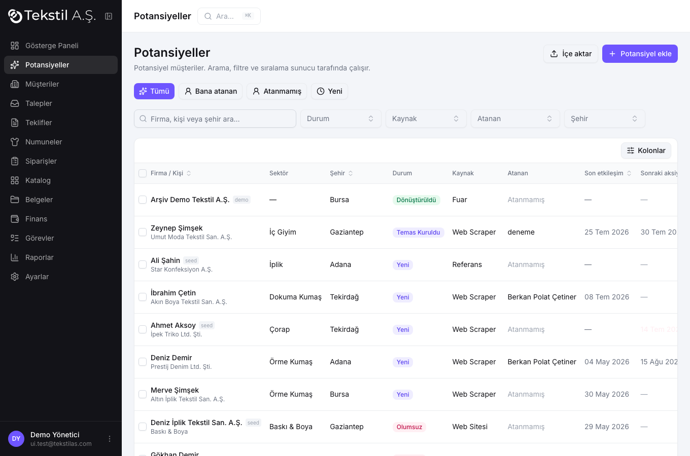

**Arama — `sik` → Şık/Şıktaş firmaları (Türkçe duyarsız firma araması):**

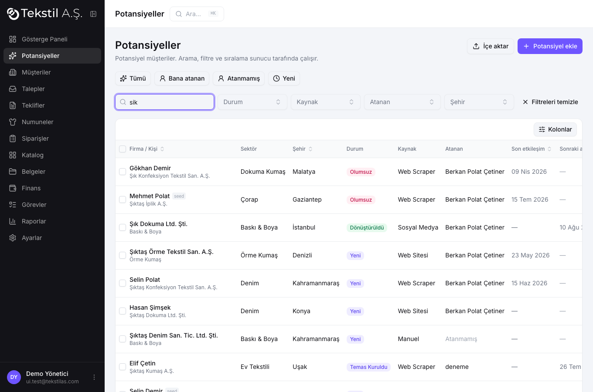

**Mobil (390×844):**

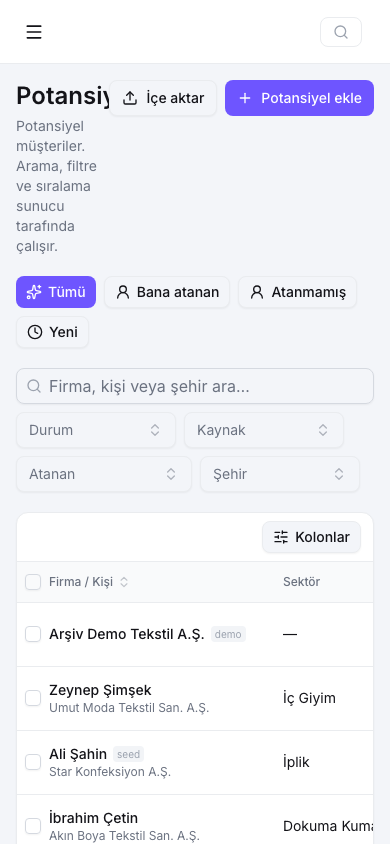

**Toplu işlem çubuğu (satır seçilince: ata / durum ata / sil):**

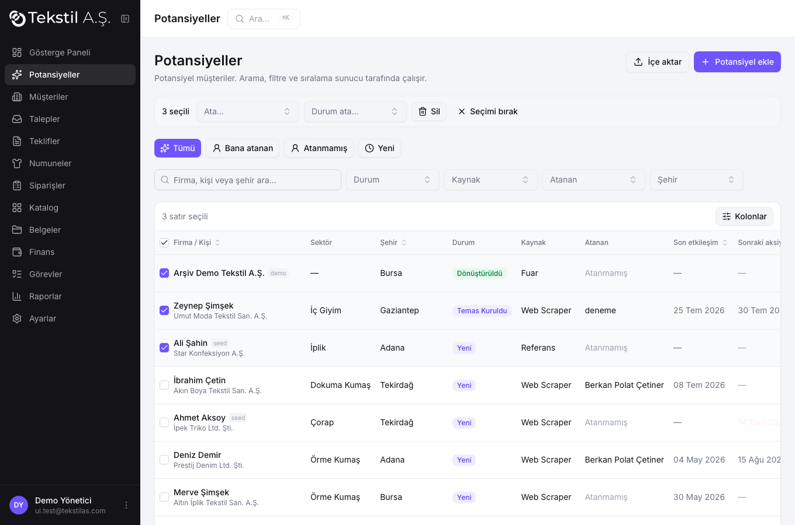

### 1.2 Potansiyeller — Kart

Sekmeler: Genel / Etkileşimler / Notlar / Dosyalar / Zaman Çizelgesi. Genel'de detay
ızgarası + iletişim noktaları (ekle/sil). Etkileşimler/Notlar/Dosyalar sekmeleri
P1.5–P1.6 ile, Zaman Çizelgesi P1.7 ile dolacak. "Müşteriye dönüştür" P1.8'e kadar devre dışı.

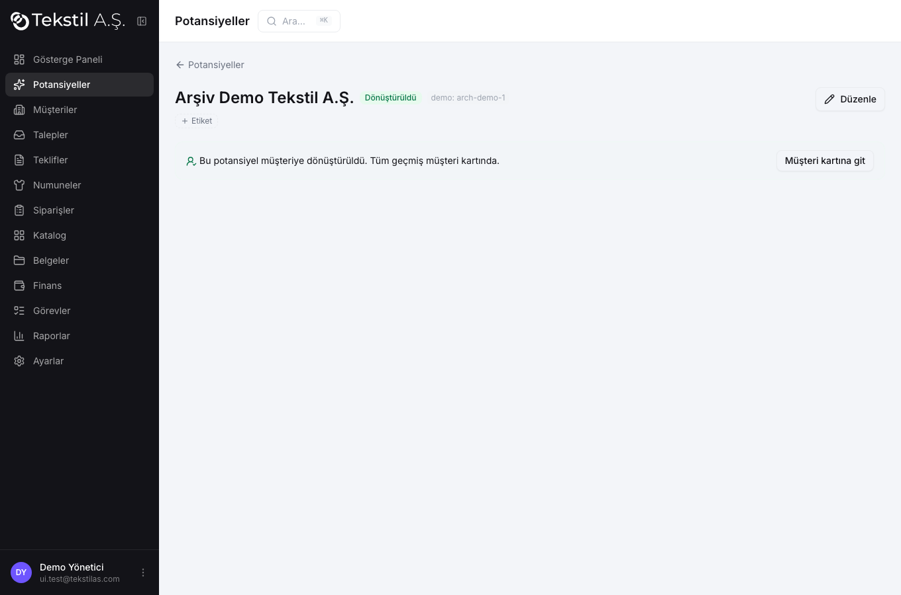

### 1.3 Potansiyel — Form (oluştur/düzenle)

Kişi **veya** firma adından biri zorunlu (CHECK aynası, istemci doğrulaması). Durum boş
bırakılırsa DB trigger varsayılanı atar. Aranabilir seçimler (durum/kaynak/atanan).

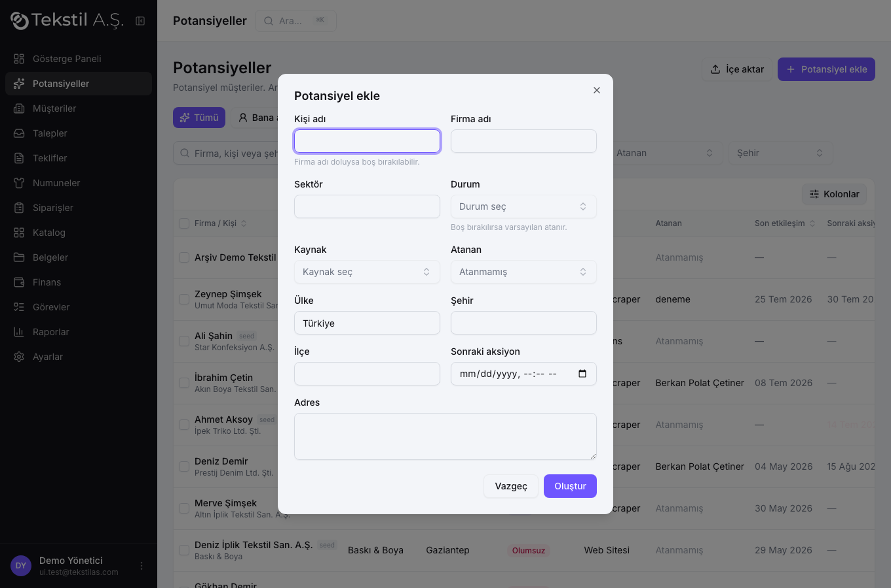

### 1.4 Müşteriler — Liste

Kod (MUS-xxxx), tür (Yurtiçi/İhracat), durum (customer_statuses), vergi no kolonu.
Arama firma/kişi/şehir **+ müşteri kodu + vergi numarası** (hepsi sunucuda). 600 kayıt.

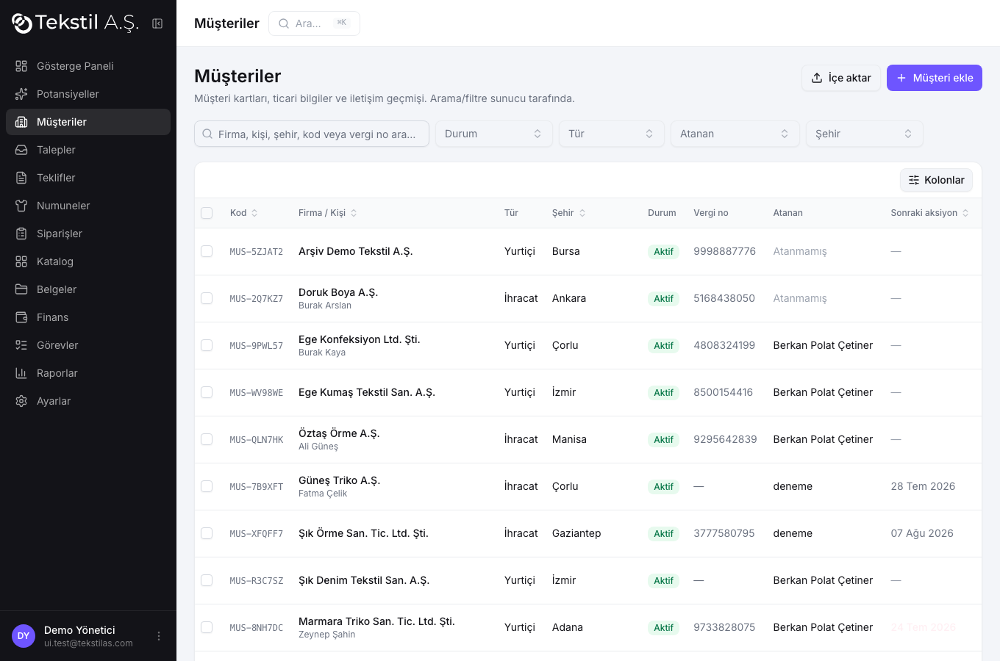

**Mobil:**

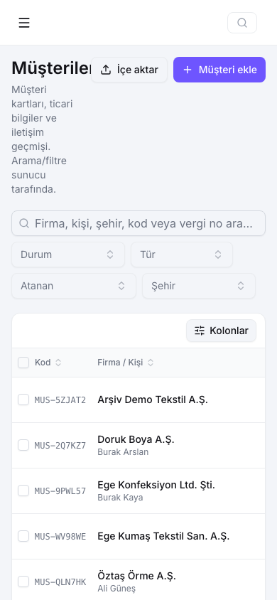

### 1.5 Müşteri — Kart

Genel detay + **Ticari bilgiler** bölümü (vergi dairesi/no, IBAN, banka, hesap sahibi —
hepsi opsiyonel, eksik bilgiyle çalışır). Kod + durum + tür rozetleri başlıkta.

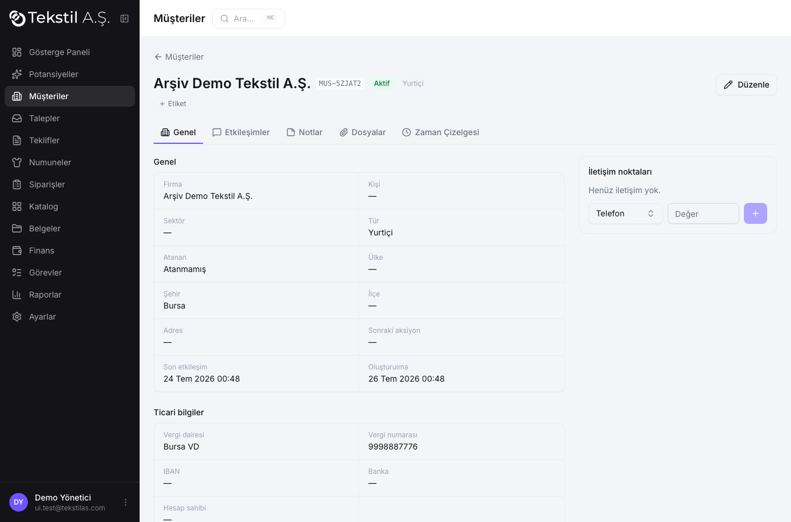

### 1.6 Müşteri — Form

Genel alanlar + ayrık **Ticari bilgiler** bloğu. Kişi veya firma zorunlu (CHECK aynası).

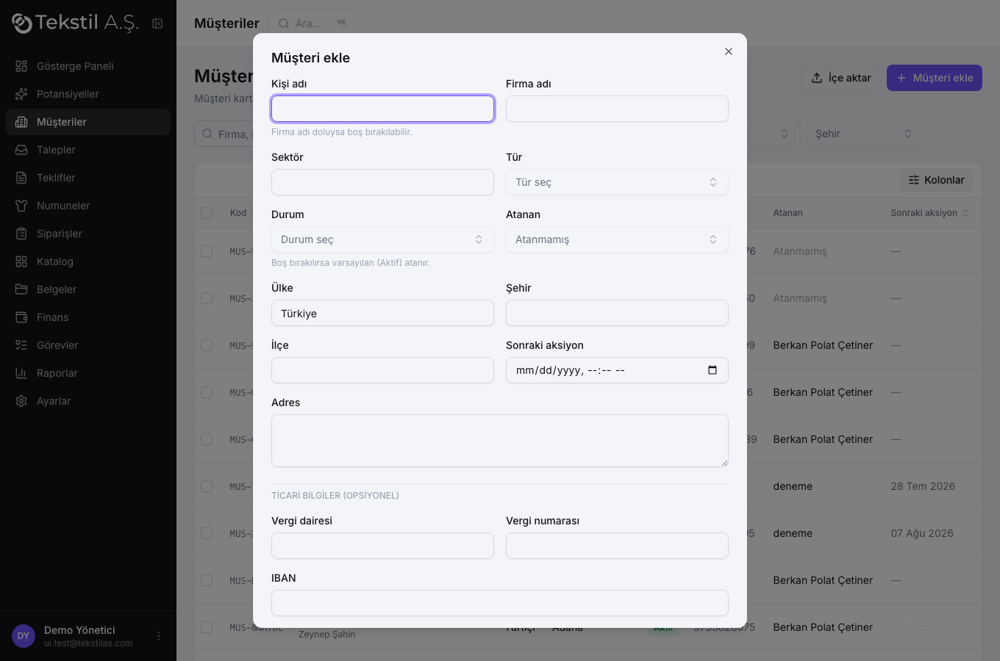

### 1.7 Etkileşimler (kart sekmesi) + Zaman Çizelgesi (event-sourced)

Lead ve customer kartında ortak `InteractionsPanel`. Kanal/sonuç/yön, ekle/sil.
`last_interaction_at` parent'ta trigger ile güncellenir.

**Zaman çizelgesi TEK KAYNAKTAN okur: `event_log`** (kaynak tablolardan birleştirme YOK).
Her domain olayı (oluşturma, durum/sorumlu değişikliği, dönüşüm, etkileşim, etiket) ilgili
trigger'da `log_event()` ile yazılır; timeline sayfalıdır ("Daha fazla"). Faz 3+'ta teklif/
sipariş/ödeme olayları yalnızca `log_event` ile eklenir — timeline sorgusu değişmez.

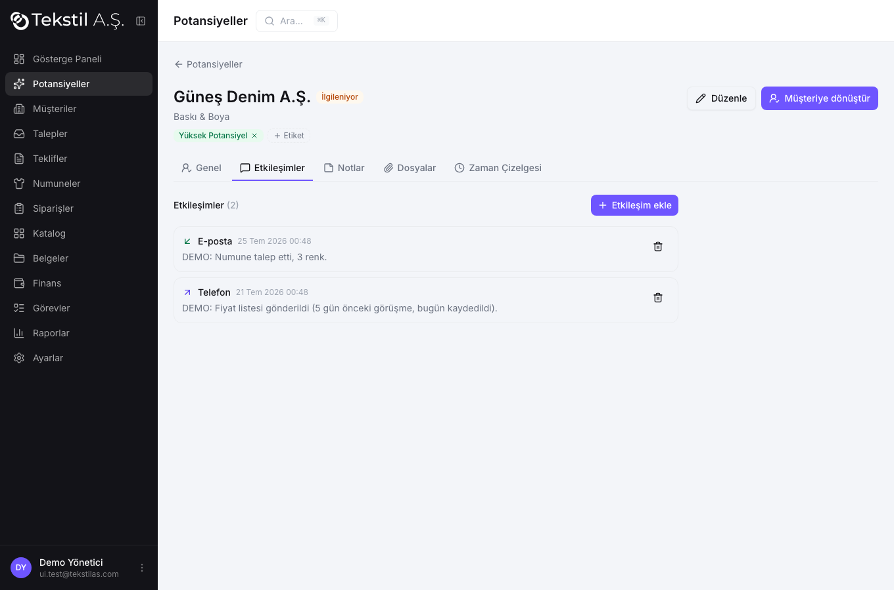

### 1.8 Notlar + Etiketler + Dosyalar (P1.6)

Kart başlığında etiket çipleri (ekle/çıkar), "Notlar" sekmesi (ekle/sil, yazar+zaman),
"Dosyalar" sekmesi (yükle/indir/sil — imzalı URL). Hepsi timeline'a olay yazar.

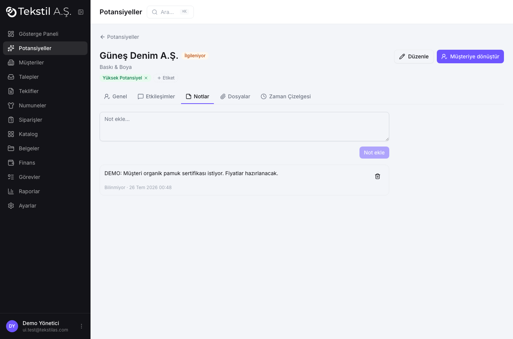

### 1.9 Zaman Çizelgesi — birleşik (event_log, occurred_at sıralı)

Etiket/not/durum/etkileşim/oluşturma olayları tek akışta; geçmişe kayıtta "N gün sonra kaydedildi".

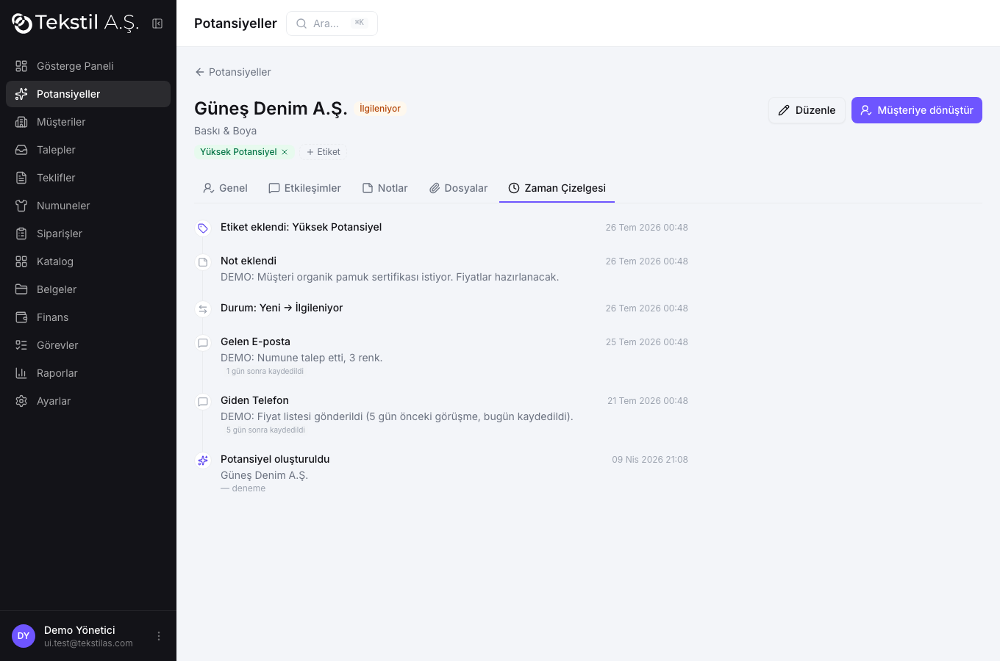

### 1.10 Dönüşüm (P1.8): potansiyel → müşteri

Dönüşüm penceresi (tür zorunlu, opsiyonel vergi/IBAN) → müşteri kartı. Alt kayıtlar +
event_log müşteriye RELINK edilir (occurred_at/created_at korunur). Lead arşiv kaydı olur.

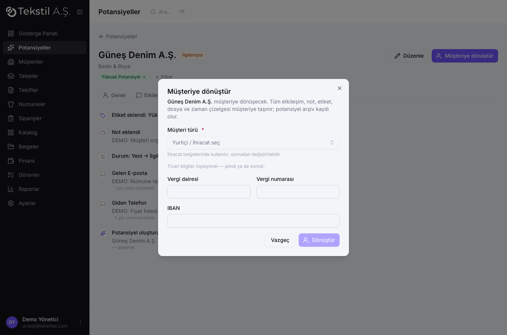

Dönüşen müşterinin zaman çizelgesi — **tüm lead geçmişi taşınmış**, occurred_at korunmuş
(etkileşimler 21/23 Tem, "N gün sonra kaydedildi" notları):

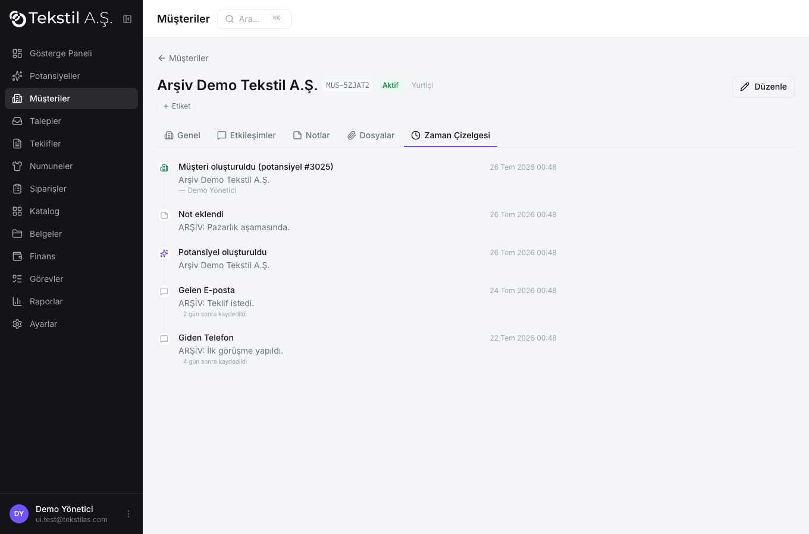

Arşivlenen lead — bant + müşteri kartı linki, sekmeler gizli:

### 1.11 Global arama + Mükerrer tespiti (P1.9)

Üst çubukta arama (Cmd/Ctrl+K) — leads+customers; firma/kişi/şehir (normalize), telefon/e-posta
(contact_points), vergi no, müşteri kodu. Sunucu tarafı `global_search` RPC.

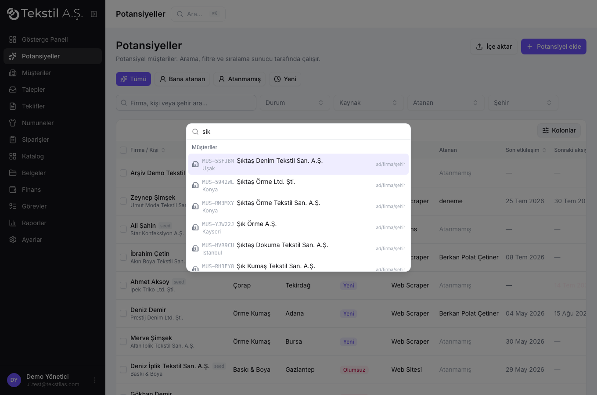

Form içinde mükerrer uyarısı (aynı firma/telefon/vergi no) — engellemez, uyarır + linkler:

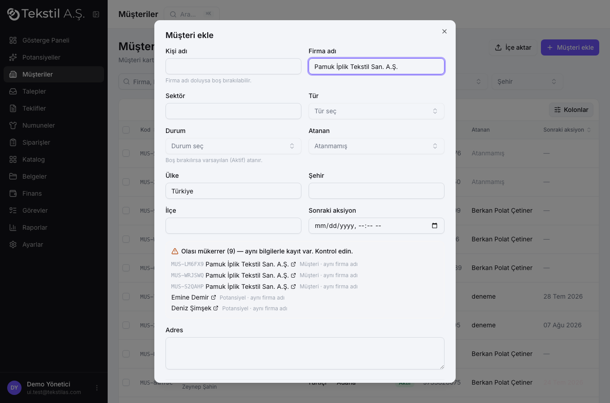

**Kabul testi düzeltmesi (arayüzden doğrulandı):** formlara telefon/e-posta alanı eklendi (dedup
sinyalini besliyordu ama alan yoktu); `find_duplicates` "benzer firma" (kısmi) sinyaliyle
genişletildi; kart açılışına "başka kayıt var" bandı eklendi. Üç senaryo tarayıcıda:

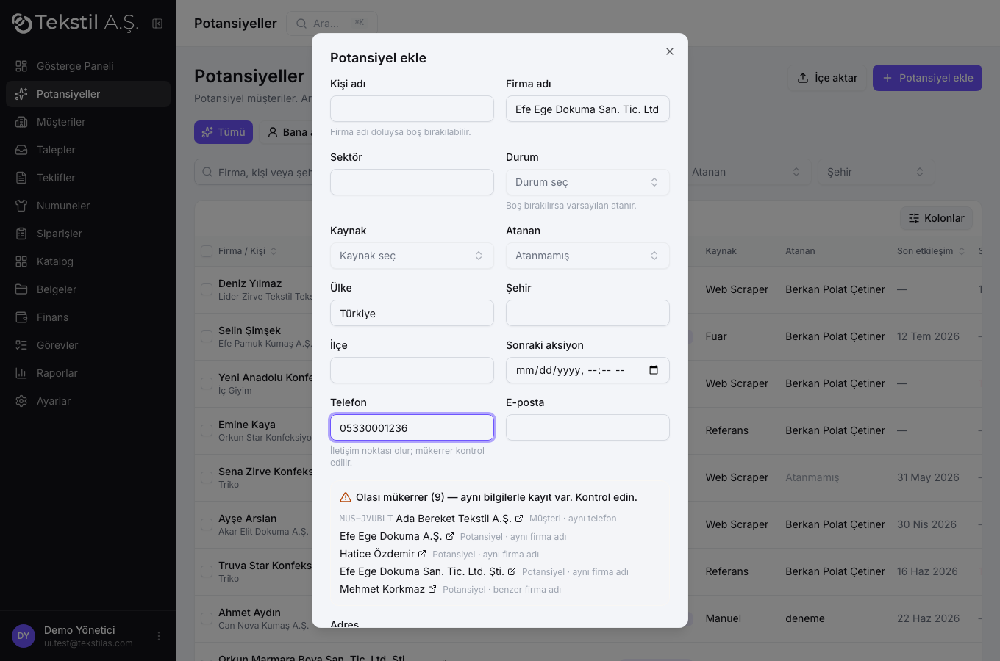

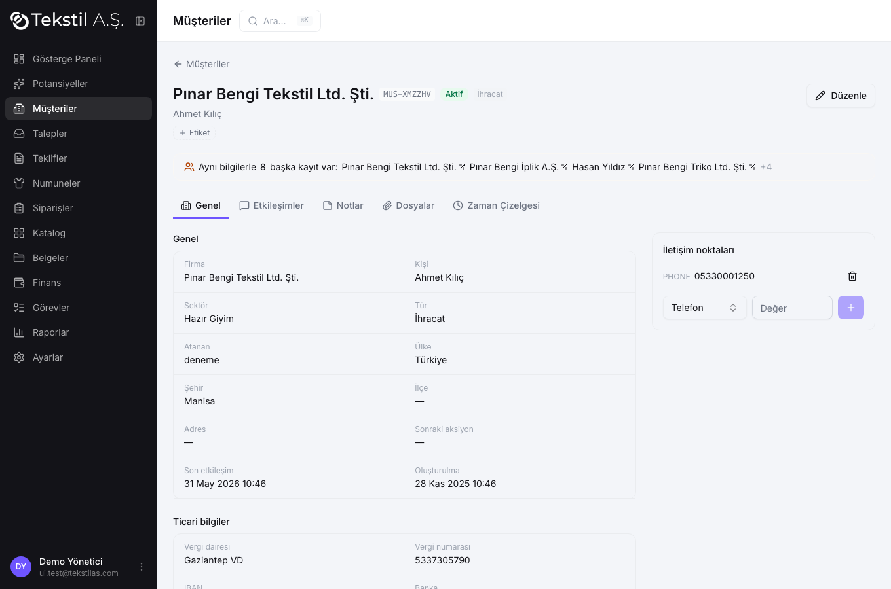

### 1.12 İçe aktarma (P1.10)

CSV yükle → **otomatik sütun eşleme** (Türkçe başlıkları tanır) + önizleme + mükerrer kontrol →
her satır bir kayıt (telefon/e-posta iletişim noktası olur) → `import_batch_id` ile bağlanır.
Hatalı satırlar Türkçe raporlanır; **tüm parti tek tıkla geri alınır** (`undo_import_batch`).

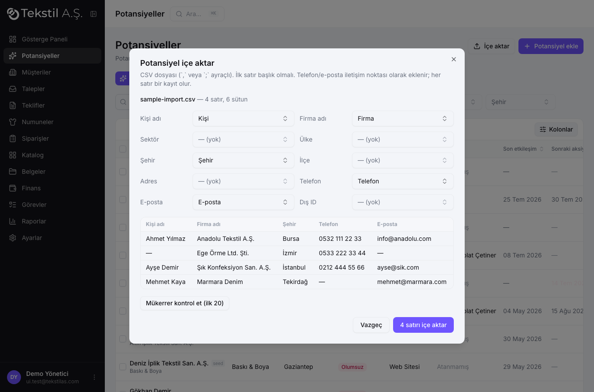

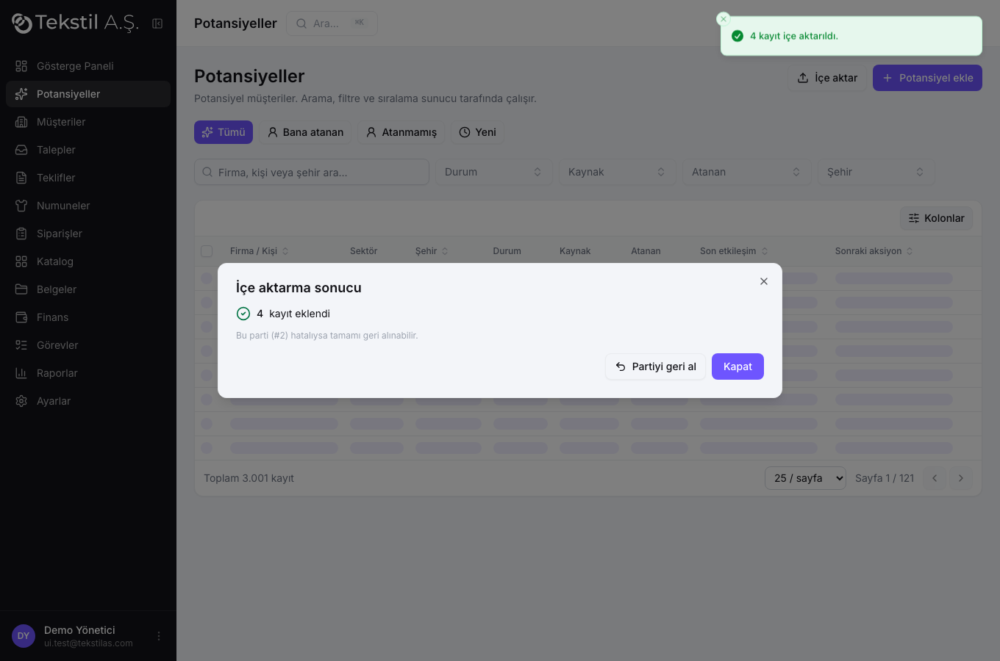

---

## 2. Kabul kriterleri (14 madde) — doğrulama + kanıt

> Faz 1 prompt dokümanındaki 14 kabul kriteri. Her madde tamamlandıkça kendi
> doğrulamam + kanıt (SQL/test/screenshot) buraya işlenir. Faz sonunda hepsi ✅ olmalı.

| # | Kriter | Durum | Kanıt |
|---|---|---|---|
| 1 | Sunucu-taraflı liste/arama/sıralama/sayfalama, 10.000+ kayıtta <500ms | 🟡 kısmi | 3.000 kayıtta `/rest/v1/leads?...&limit=25` tek istek; DB indexli. Süre ölçümü faz sonunda. |
| 2 | Türkçe/aksan duyarsız arama (DB-side normalize) | ✅ | `full_name/company/city_normalized` generated; `istanbul→209`, `huseyin→89`; fixture SQL↔TS 54/54 |
| 3 | Her mutasyon ensureRows ile korunur (RLS 0-satır sessiz reddi görünür) | ✅ | Tüm leads mutasyonları `.select('id')`+`ensureRows`; duman-testi: create/update/soft-delete birer satır döndü |
| 4 | Fiziksel silme yok (deleted_at/by) | ✅ | Silme = `deleted_at` update; duman-testi: silinen aktif listede yok (`is('deleted_at',null)` → 0) |
| 5 | Varsayılan durum DB'den (trigger) | ✅ | lead: status_id vermeden create → `yeni`; customer → `aktif` |
| 6 | Müşteri kodu benzersiz (code_registry) | ✅ | MUS-xxxx BEFORE INSERT; 600 seed → 600 tekil kod; duman-testi MUS-99ZY9D |
| 7 | Vergi no arama + mükerrer sinyali normalize | ✅ | `tax_number_normalized` (sadece rakam) indexli; '12 345 678 90'→'1234567890' arama eşleşti |
| 8 | Etkileşim → `last_interaction_at` otomatik güncellenir | ✅ | trigger: ekle→occurred_at (07-20), soft-delete→null (aktif kalmayınca); SECURITY DEFINER |
| 9 | Zaman çizelgesi tek kaynaktan (event_log), sayfalı | ✅ | trigger'lar log_event yazar; timeline event_log okur; backfill 3000 lead.created + 600 customer.created; canlı status/assign/interaction event testi geçti |
| 10 | Not/etiket/dosya + timeline olayları | ✅ | notes/entity_tags/files trigger'ları event_log yazar; kart panelleri (görsel); note.added/tag.added canlı doğrulandı |
| 11 | Timeline occurred_at sıralı + geçmişe kayıt notu | ✅ | event_log.occurred_at; "5 gün sonra kaydedildi" (görsel) |
| 12 | Dönüşüm kesintisiz + atomik + idempotent | ✅ | `scripts/test-conversion.sql` 3 senaryo GEÇTİ — S0 mutlu yol (lead=0/customer=tam, 13 olay taşındı, occurred_at korundu, last_interaction_at doğru); S1 iki-kez-dönüşüm reddedildi (tek müşteri); S2 null tür → exception + hiçbir şey değişmedi (atomik). Doğrulama upfront (insert öncesi) → kısmi müşteri hiç oluşmaz. |
| 13 | Uçtan uca zincir (oluştur→etkileşim→not→dönüştür→timeline) | ✅ | RPC + UI: dönüşen müşteri timeline'ı taşınan geçmişi occurred_at sıralı gösterir (görsel) |
| 14 | Global arama + mükerrer tespiti (sunucu tarafı, RLS'e saygılı) | ✅ | `global_search`/`find_duplicates` RPC (SECURITY INVOKER); psql: 'sik'→Şık firmaları, vergi no→tam eşleşme, aynı firma adı→mükerrer; UI görselleri §1.11 |
| — | _(import P1.10, örnek veri P1.11, test/doc P1.12)_ | ⏳ | — |

_(Not: 14 maddenin tam listesi Faz 1 prompt'undan alınıp buraya genişletilecek; şu an
kanıt üretilen maddeler işlendi.)_

---

## 3. Bilinen eksikler ve tartışmalı noktalar

**Eksikler (P1.3):**
- Kart sekmeleri Etkileşimler/Notlar/Dosyalar/Zaman Çizelgesi henüz placeholder (P1.5–P1.7 dolduracak).
- "Müşteriye dönüştür" P1.8'e kadar devre dışı.
- Dışa aktar (CSV/Excel) henüz yok — liste başlığından kaldırıldı, P1.10 civarı eklenebilir.
- <500ms performans hedefi henüz ölçülmedi (3.000 kayıt hızlı; 10.000+ ölçümü faz sonunda).

**Tartışmalı / karar bekleyen (benim şüphelerim):**
- **Şehir filtresi kaynağı:** Şehir seçenekleri leads'ten distinct çekiliyor (`useLeadCityOptions`).
  Kayıt arttıkça bu sorgu büyür ve serbest metin şehir tutarsızlığı taşır. Şehir bir **referans
  tablosu** mu olmalı (P1.1 kalıbı), yoksa serbest metin + normalize yeterli mi? Karar senin.
- **Durum tonu haritası istemcide:** `STATUS_TONE` (yeni→info, olumsuz→danger...) `LeadsListPage`
  içinde sabit. Renk "tek yerden yönetilsin" kuralı için `lead_statuses.color` sütunu var; tonu
  oradan türetmek daha doğru olabilir. Şimdilik anahtar→ton eşlemesi kodda.
- **Arama `.or()` üç sütun ilike `%term%`:** başta-değil-içinde arama; büyük hacimde trigram (pg_trgm)
  GIN index gerekebilir. Şimdilik b-tree yeterli, ama 10.000+ ile ölçülmeli.
- **Sıralama ikincil anahtar `id desc`:** stabil sayfalama için eklendi; kullanıcı beklentisiyle
  (ör. ada göre ikincil) çelişebilir — geri bildirim iyi olur.
- **Kod üreteci birleştirildi (çözüldü):** başta müşteriye ayrı `generate_customer_code` yazmıştım;
  kullanıcı isteğiyle tek fonksiyona indirdim. `generate_operation_code(entity_type, entity_id)`
  öneki `codes.<entity_type>_prefix` → `codes.default_prefix` → `TAS` sırasıyla ayardan okur.
  Müşteri = MUS (codes.customer_prefix), operasyon = TAS (default). Faz 3/4'te yeni fonksiyon değil,
  sadece ayar eklenir (kanıt: geçici `codes.numune_prefix=NUM` → NUM-xxxx). Eski MUS kodları değişmedi.
  Ölü satır (`codes.operation_prefix`) silinemez (settings guard) ama **`settings.is_deprecated`**
  ile işaretlendi; System ayarlarında varsayılan gizli, "Kullanım dışı ayarları göster" ile listelenir
  (genişletilebilir emeklilik kalıbı). 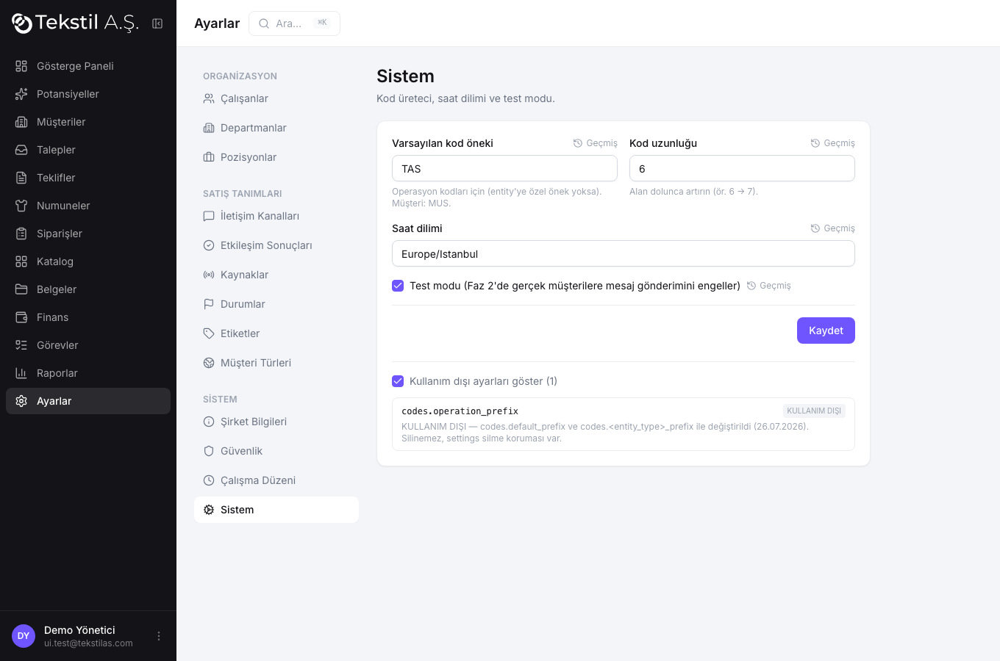
- **customers arama `.or()` 5 sütun:** firma/kişi/şehir normalize + kod + vergi no. Geniş; büyük
  hacimde trigram gerekebilir (leads ile aynı endişe).
- **Timeline sıralaması `occurred_at` (çözüldü):** `event_log.occurred_at` alanı eklendi; timeline
  "ne zaman OLDU"ya göre sıralar (created_at = log/denetim zamanı ayrı tutulur). `log_event`
  opsiyonel `p_occurred_at` alır (etkileşim trigger'ı `interactions.occurred_at`'i geçirir).
  Geçmişe kayıtta satırda "N gün sonra kaydedildi" rozeti gösterilir. Faz 3'te ödeme/kargo/teslim
  tarihleri de aynı alana yazılacak. Backfill: occurred_at = created_at (mevcut 3600 satır).

---

## 4. Uçtan uca test: potansiyel → etkileşim → not → müşteriye dönüştür → zaman çizelgesi

_(P1.5 etkileşimler, P1.6 notlar, P1.8 dönüşüm tamamlanınca çalıştırılacak; zincirin
kesintisiz olduğu — özellikle dönüşümde zaman çizelgesinin kopmadığı — burada kanıtlanacak.)_

## 6. Kabul testi düzeltmeleri — ARAYÜZDEN doğrulandı

> Kural: bir madde "kanıtlı" ise **tarayıcıdan** test edilmiştir (psql yetmez). Her satır bir
> Playwright test scripti + görsel ile doğrulandı.

| Madde | Düzeltme | Arayüz kanıtı (görsel) |
|---|---|---|
| Mükerrer tespiti | Forma telefon/e-posta alanı; find_duplicates **çekirdek+pg_trgm 0.6** (sözlük ayarda); kart bandı; override→`dedup.overridden` | `dedup-form`, `dedup-card-band` (`test-dedup-ui.mjs`) |
| Telefon havuzu | Teşhis: normalize doğru, seed dar havuz → benzersiz telefon; firma havuzu genişletildi | seed 3601/3601 tekil |
| İçe aktarma geçmişi + geri al | Geçmiş ekranı + parti başına "Geri al" (çalışılmış kayıt atlanır) | `import-history` |
| İçe aktarma dedup | Aynı dosya 2. kez → hepsi "atlandı"; tüm-dosya kontrolü | `import-second-skipped` (`test-import-ui.mjs`) |
| Eşleme hatırlama | `import_batches.column_mapping`; aynı dosya/başlık → öntanımlı | "önceki eşleme uygulandı" |
| Toplu etiket + dışa aktarma | Toplu barda Etiket ekle + Dışa aktar; başlıkta Dışa aktar (filtre sonucu) | `leads-bulk-full` (`test-p3p4-ui.mjs`) |
| Dönüştürülenleri gizle | Varsayılan gizli + "Dönüştürülenleri göster" | `leads-bulk-full` |
| Liste telefon araması | contact_points üzerinden telefon/e-posta | `leads-phone-search` (1–1/1) |
| Müşteri Faz-3 sekmeleri | Talepler/Teklifler/Numuneler/Siparişler/Cari placeholder | `customer-phase3-tabs` |
| Toplam sayaç | "1–25 / 3.000 kayıt" | `leads-phone-search` altbilgi |
| Dosya indirme | Doğrudan indir (Content-Disposition + download attr) | kod |

## 5. Test paketi (P1.12) — tümü yeşil

| Test | Kapsam | Sonuç |
|---|---|---|
| `pnpm typecheck` | tsc -b strict | ✅ temiz |
| `pnpm lint` | eslint | ✅ temiz |
| `pnpm test` (Vitest) | normalize + telefon fixture (SQL↔TS kaynak) | ✅ 87/87 (6 dosya) |
| `scripts/check-normalize-consistency.mjs` | DB `normalize_tr`/`normalize_contact_value` = fixture | ✅ 54/54 |
| `scripts/test-conversion.sql` | dönüşüm 3 senaryo (mutlu yol sayım + iki-kez + null-atomik) | ✅ 3/3 |
| İçe aktarma undo (psql) | parti geri alma + tekrar reddi | ✅ |
| `scripts/faz1_shots.mjs` | 20+ ekran görüntüsü (bu dosyada) | ✅ |

Çalıştırma sırası (özet): `supabase db push` → `supabase gen types` → `pnpm typecheck && pnpm lint && pnpm test`
→ (DB testleri PG* env ile) `node scripts/check-normalize-consistency.mjs` → `psql -f scripts/test-conversion.sql`.

---

## 4. Uçtan uca test: potansiyel → etkileşim → not → müşteriye dönüştür → zaman çizelgesi (devam)

**Durum:** ✅ karşılandı. `scripts/test-conversion.sql` dolu bir potansiyel (her alan + 5 etkileşim
+ 3 not + 2 etiket + 2 dosya + 13 event) oluşturur, dönüştürür, kaynak/hedefte her tabloyu sayar.
Sonuç: müşteride tam, lead'de sıfır; event_log occurred_at/created_at korunarak taşındı; en eski
olay dönüşüm öncesi=sonrası; customer.last_interaction_at = en yeni etkileşim; lead null. Tek eksikte
test kırılır (RAISE EXCEPTION). Görsel kanıt: dönüşen müşteri timeline'ı (§1.10) taşınan geçmişi
occurred_at sıralı ve "N gün sonra kaydedildi" notlarıyla gösteriyor.
