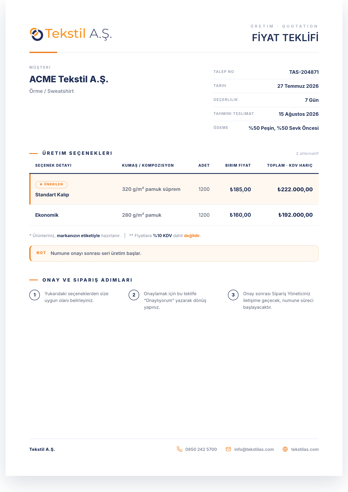
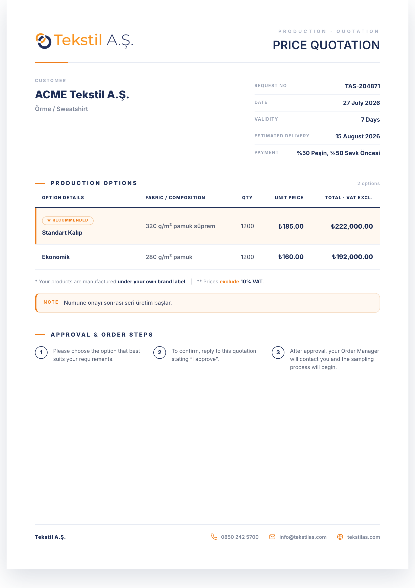
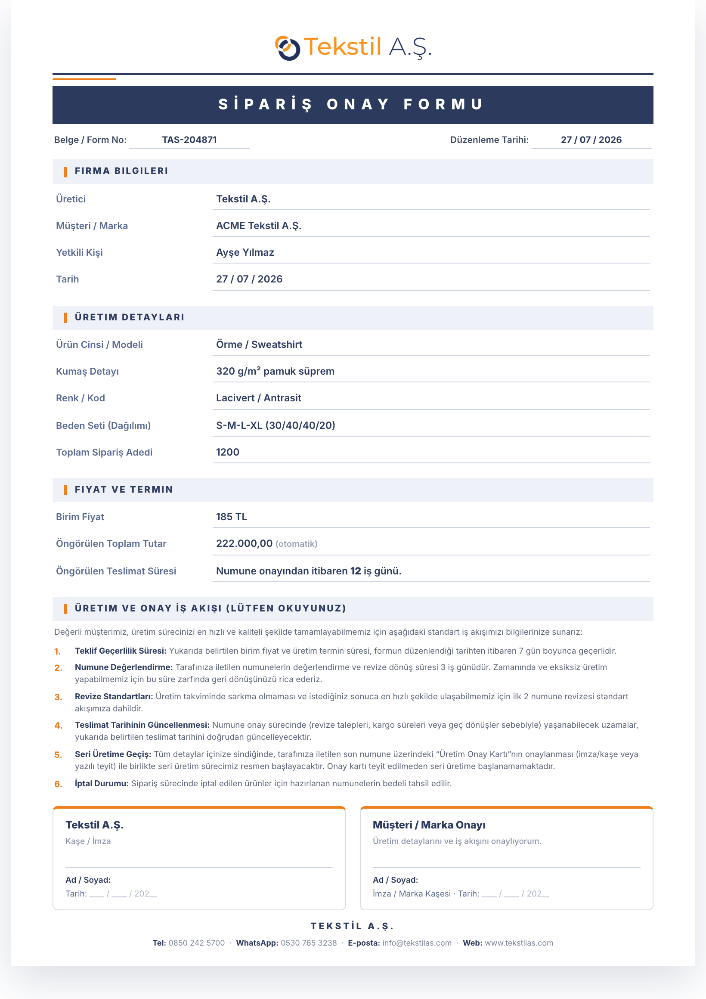
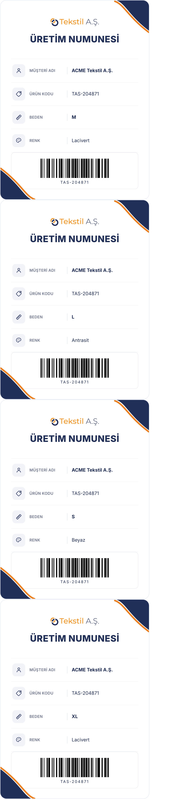
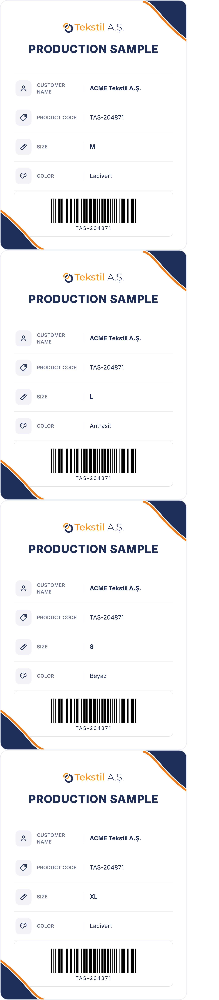
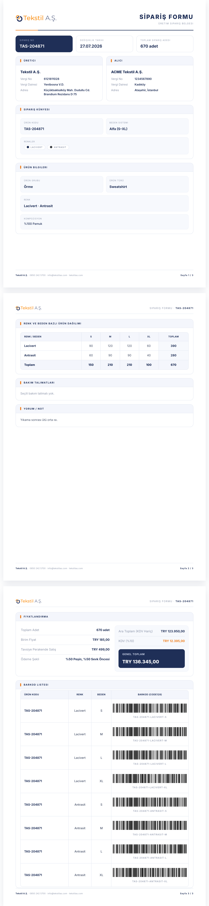
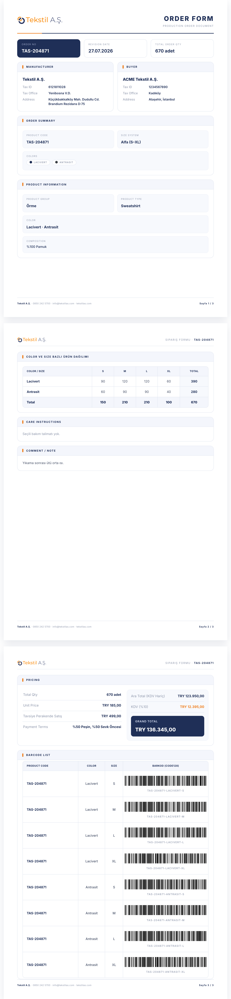
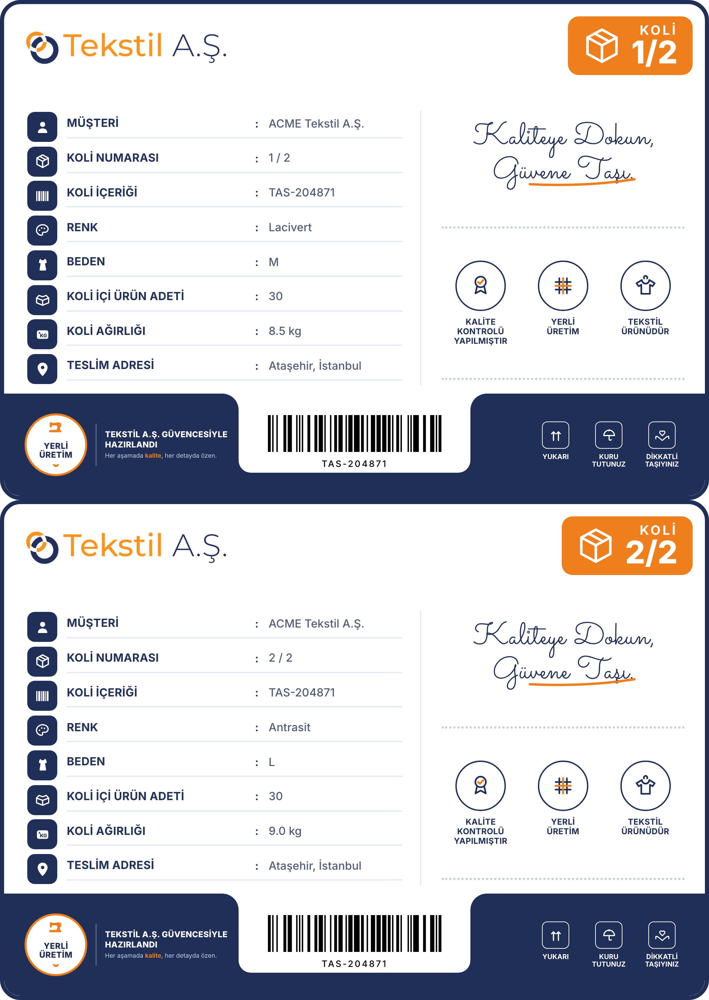
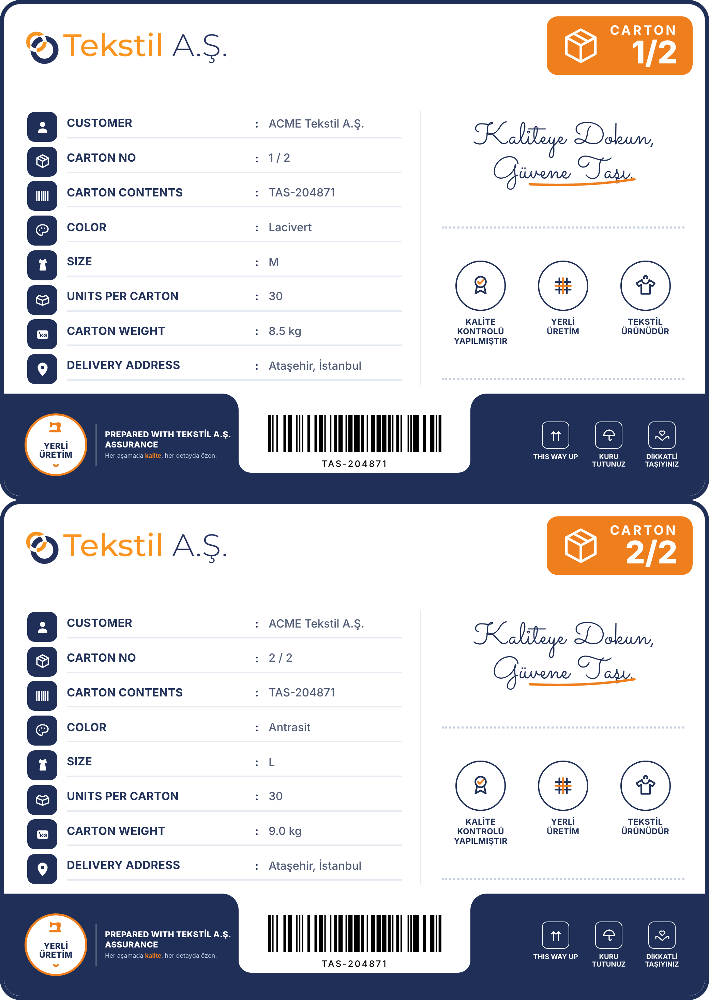

# Faz 4A — Belge Ekran Görüntüleri (TR + EN)

Beş belgenin **Türkçe** ve **İngilizce** çıktıları yan yana. Amaç: çevirinin tam olduğunu
ve İngilizce metnin tasarımda **taşma** yapmadığını gözle doğrulamak. Görüntüler PDF servisinin
`/preview` çıktısından (birebir aynı HTML+CSS, barkodlar önceden çizili) A4 genişliğinde alınmıştır.

> Üretmek için: PDF servisi ayakta iken `node scripts/faz4a-ekranlar.mjs`
> (görüntüler `docs/assets/faz-4a/ekran-*.png` altına yazılır).

Notlar:
- **Fiyat teklifi** İngilizceyi *native* üretir (`tkS.dil='en'`), diğer dördü render sırasında
  sözlükle (`services/pdf-renderer/i18n.mjs`) çevrilir — 6 iş-akışı gövde paragrafı dâhil.
- **Etiket/başlık dışındaki alanlar** (müşteri adı, renk, ödeme koşulu metni gibi) kullanıcı
  verisidir; ihracat müşterisi için bunlar da İngilizce girilir. Ekranlarda bilinçli olarak
  Türkçe örnek veri kullanılmıştır ki sabit metin (label) çevirisi ile veri ayrışsın.
- Üretici bilgileri (Vergi No, adres, telefon) `settings.company.*` üzerinden gelir — koda gömülü değildir.

---

## 1. Fiyat Teklifi / Price Quotation

| Türkçe | İngilizce |
|---|---|
|  |  |

## 2. Sipariş Onay Formu / Order Confirmation Form

Bağlayıcı metinlerin (onay adımları, ödeme koşulları, iş akışı) tamamı çevrilidir.

| Türkçe | İngilizce |
|---|---|
|  |  |

## 3. Numune Etiketi / Production Sample Label

A4 başına 4 etiket. Barkod harfli kodu (`TAS-…`) basar.

| Türkçe | İngilizce |
|---|---|
|  |  |

## 4. Sipariş Formu / Order Form

Üç sayfa (künye + renk×beden dağılımı + fiyatlandırma/barkod listesi).

| Türkçe | İngilizce |
|---|---|
|  |  |

## 5. Koli Üstü Etiketi / Carton Label

A4 başına 2 etiket.

| Türkçe | İngilizce |
|---|---|
|  |  |

---

## Taşma kontrolü — sonuç

Beş belgede de İngilizce metin, kutulara/satırlara sığıyor; başlık şeritleri, tablo hücreleri
ve imza blokları taşmıyor. Otomatik kontrol (`scripts/test-belge-p4a9.mjs` → adım [3]) İngilizce
çıktıda bilinen Türkçe etiketlerin sızmadığını doğrular.
