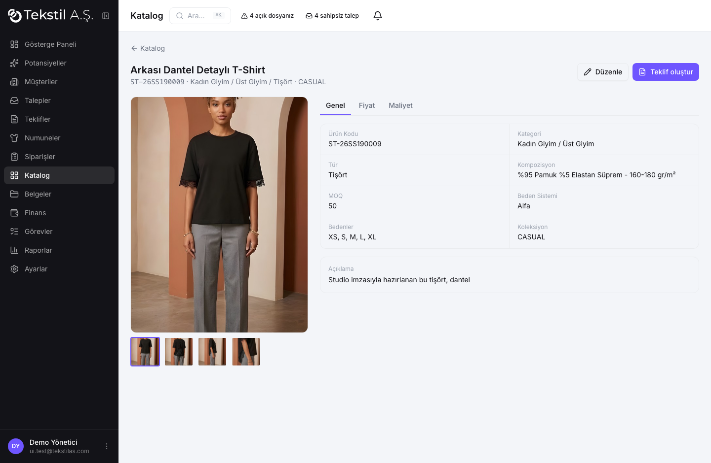
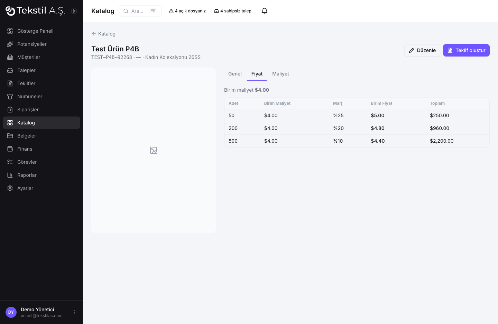
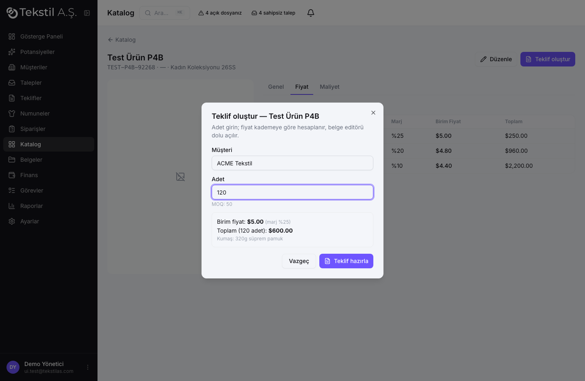
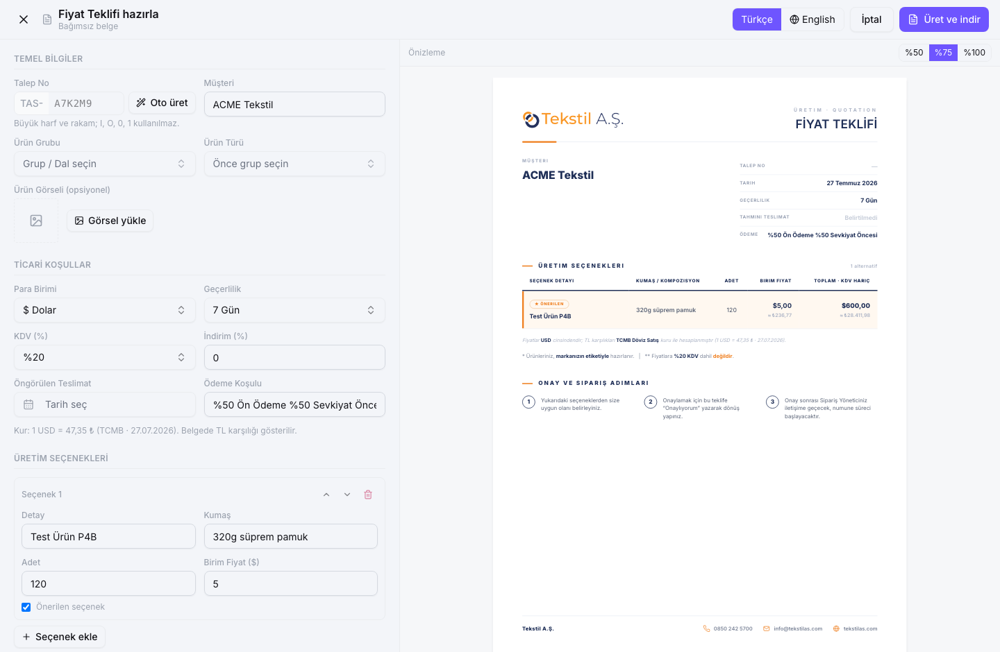

# Faz 4B — Katalog, Maliyet, Fiyat Ekran Görüntüleri

## Katalog listesi (ızgara)
143 ürün PDF'ten aktarıldı; fotoğraf + ad + kod + kategori. Filtre: katalog/koleksiyon/kategori/
maliyet var-yok/durum · arama (kod/ad/kompozisyon, normalize).

## Ürün kartı
Galeri (detay/arka/yan), teknik bilgiler, sekmeler: Genel · Fiyat · **Maliyet** (yetkiye bağlı),
"Teklif oluştur".

## Fiyat kademeleri (P4B.6)
Birim maliyetten adet kademesine göre marj (aralık mantığı) → birim fiyat + toplam.

## Tek-tuş teklif (P4B.8)
Adet girilir → fiyat kademeye göre server tarafında hesaplanır (maliyet sızmadan). "Teklif hazırla".

## Belge editörü — dolu gelir
Müşteri, para birimi (USD), **kumaş maliyet reçetesinden otomatik**, adet+birim fiyat hesaplı,
kur notu (TCMB, TL karşılığı). Kullanıcı düzenleyebilir, "Üret ve indir".

---

Hesap ayrıntıları: `docs/faz-4b-hesaplar.md`. Testler: `tests/unit/pricing.test.ts` (37),
`scripts/test-catalog-p4b.mjs` (sızıntı/entegrasyon), `scripts/import-catalog.mjs` (içe aktarma).
