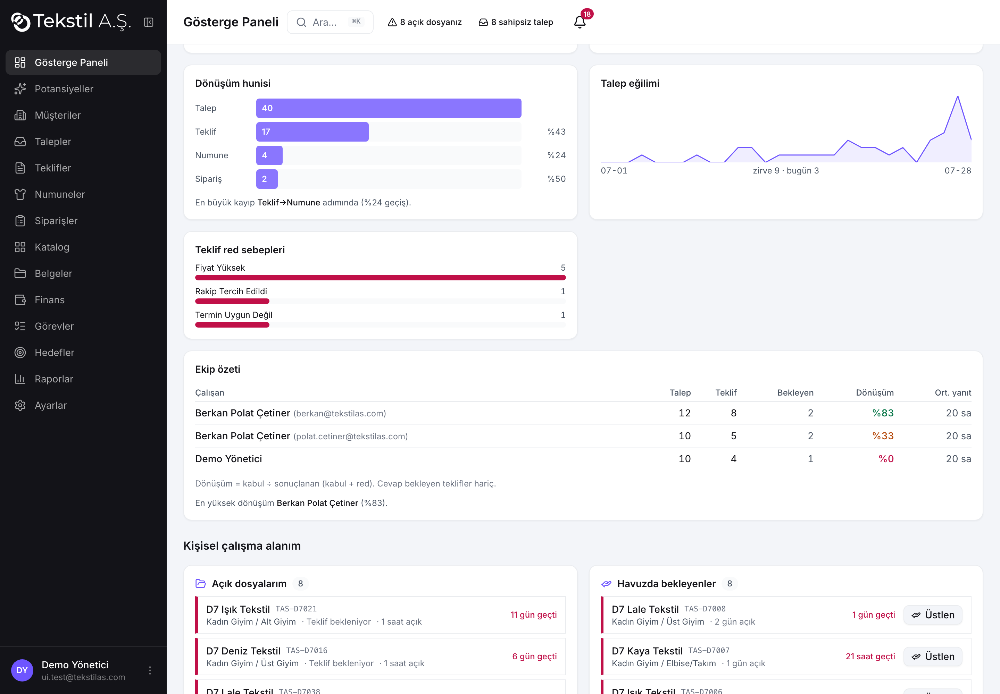
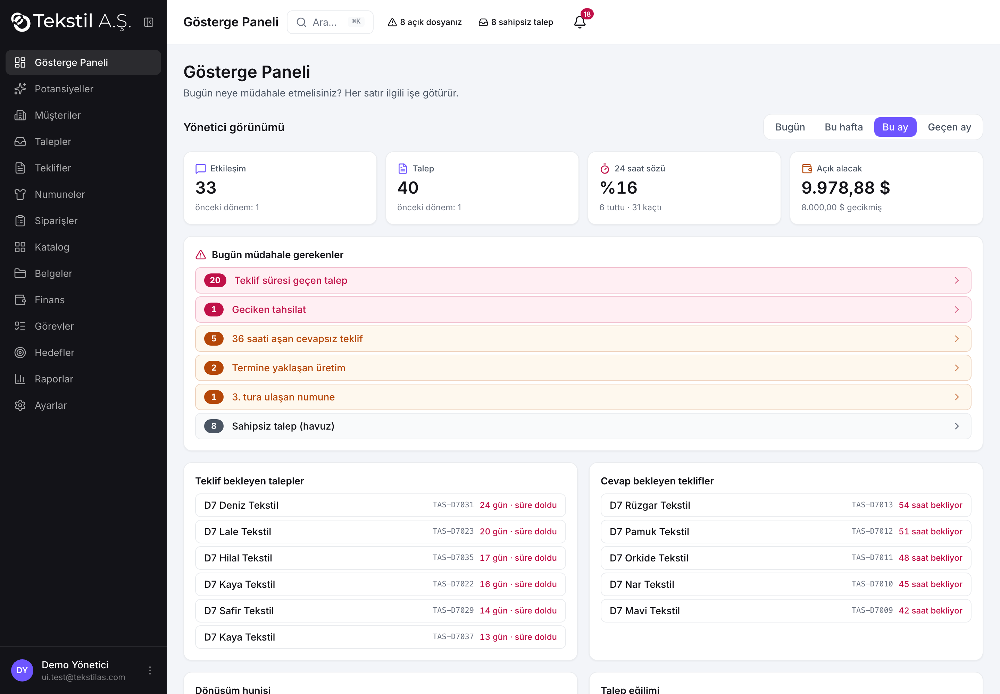
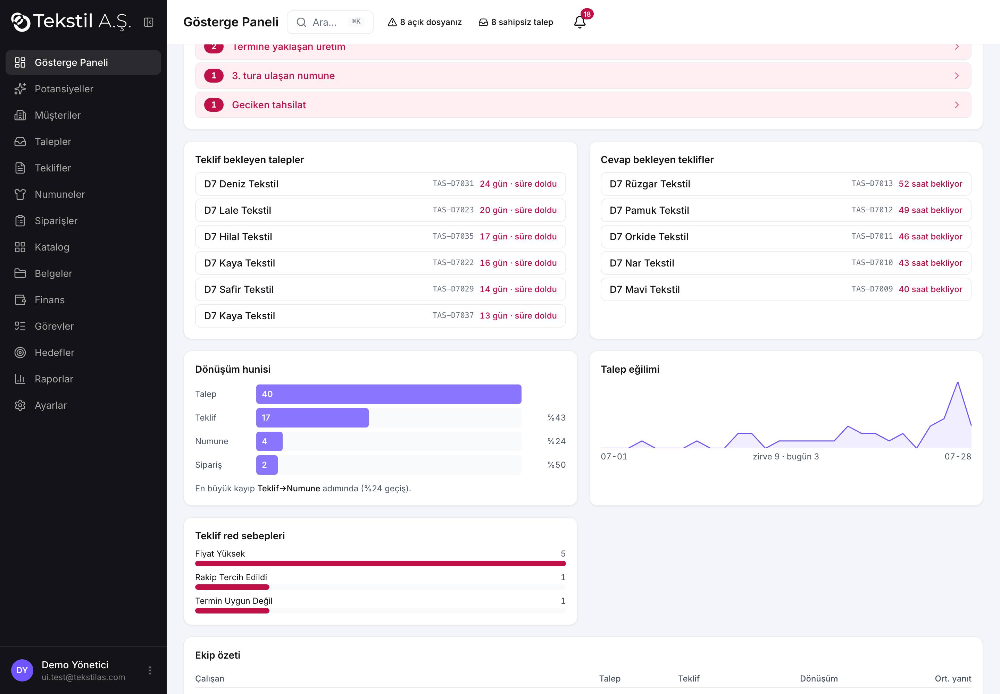
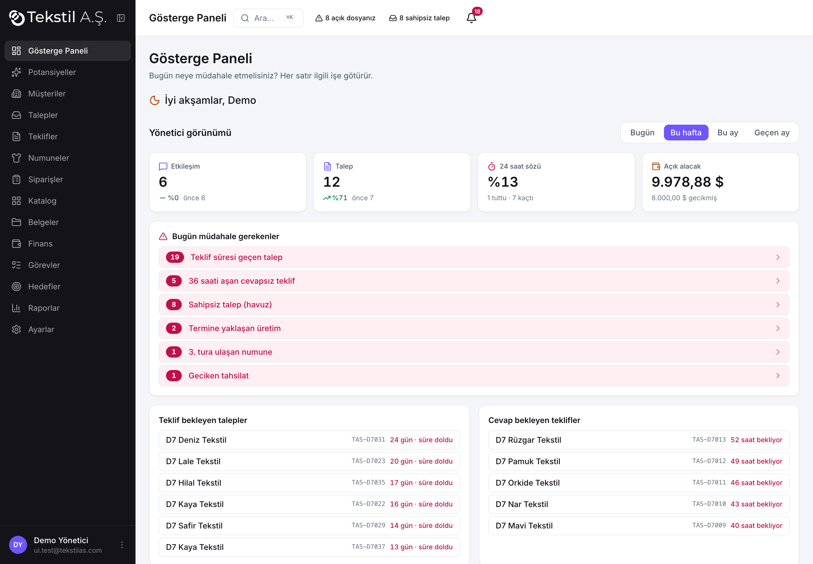
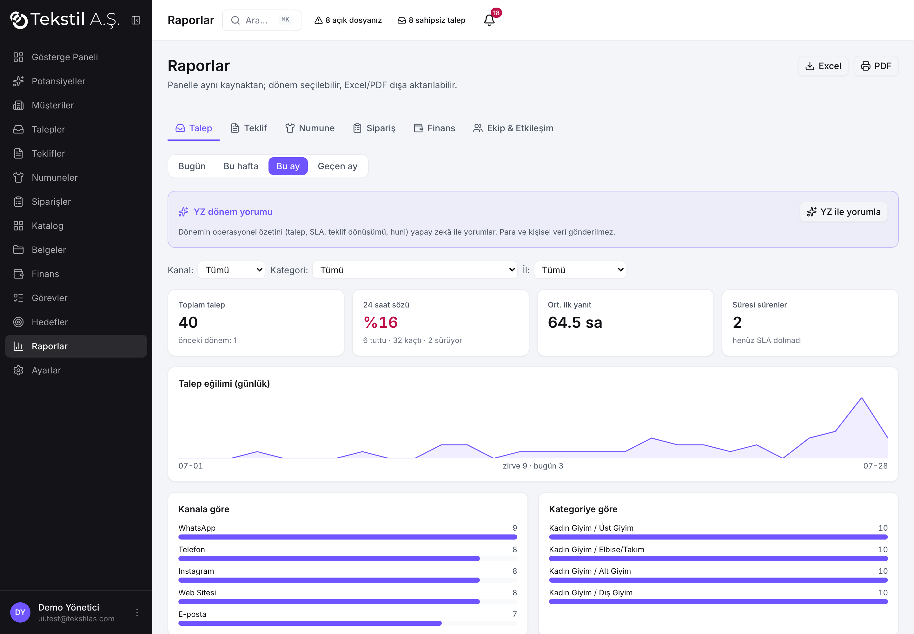
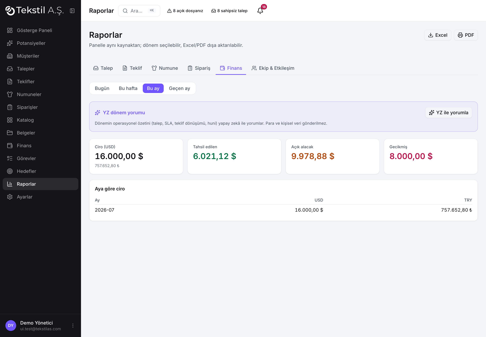
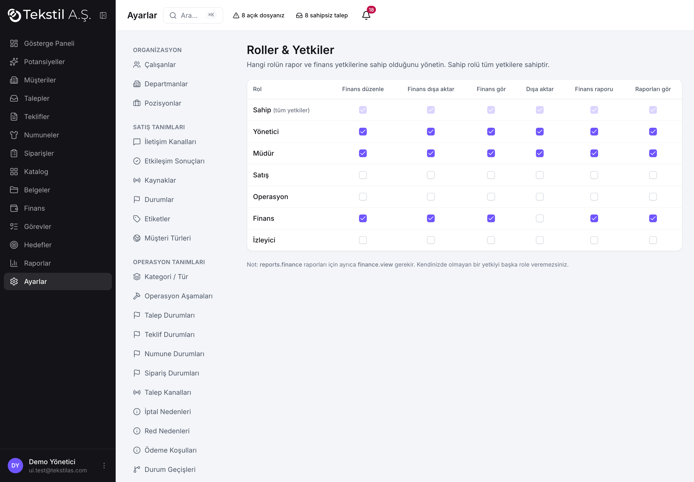

# Faz 7 — Raporlar ve Gösterge Paneli · Ekran Görüntüleri

Tüm ekranlar **gerçekçi demo veriyle** alındı (`scripts/seed-dashboard-demo.mjs`).
Giriş: `ui.test@tekstilas.com` (Demo Yönetici — `reports.view` + `finance.view`).
Boş panelde her şey "çalışıyor" görünür; asıl doğrulama dolu durumdadır — bu yüzden
40 operasyon, 17 teklif, 4 numune, 2 sipariş, geciken tahsilat ve 3 çalışanlık
ekip verisiyle test edildi.

> Demo veriyi üretmek/temizlemek:
> ```
> node scripts/seed-dashboard-demo.mjs          # üret
> node scripts/seed-dashboard-demo.mjs --clean   # temizle (DEMO7 işaretli)
> ```

---

## P7.2 — Çalışan gösterge paneli

Dört blok, hepsi tıklanabilir → `/talepler/:id`, gerçek zamanlı (45 sn):
**Açık dosyalarım · Havuzda bekleyenler (Üstlen) · Bugünkü görevlerim · Ertelediklerim.**
Satırların sol kenarı süreye göre renklidir (geçmiş kırmızı · 24 saat sarı · rahat gri),
"N gün açık" ve "kaldı/geçti" etiketleri gösterilir.



---

## P7.3 — Yönetici gösterge paneli

`reports.view` olan kullanıcıya, kişisel çalışma alanının **üstünde** görünür.
Tüm sayılar `metrics.*` tek kaynağından; dönem seçimi URL'de saklanır (paylaşılabilir link).

### Genel görünüm (dönem: Bu ay)



- **Üst şerit (4 rakam + değişim %):** Etkileşim · Talep · 24 saat sözü · Açık alacak.
  Her kart bir önceki eşit döneme göre ↑/↓ yüzdeyi ve alt bilgiyi gösterir, tıklayınca
  ilgili rapora/ekrana gider. "24 saat sözü" %80+ yeşil, %50+ sarı, altı kırmızı;
  "6 tuttu · 30 kaçtı" ayrıntısıyla. Açık alacak yalnız `finance.view` olanlara açılır
  (yoksa "—, finans yetkisi gerekli").
- **Bugün müdahale gerekenler:** canlı ("şimdi") sorun listesi — teklif süresi geçen (19),
  36 saati aşan cevapsız teklif (5), sahipsiz talep (8), termine yaklaşan üretim (2),
  3. tura ulaşan numune (1), geciken tahsilat (1). **Sıfır olan satırlar gizlenir**,
  her satır ilgili filtreli ekrana götürür. Geciken tahsilat yalnız `finance.view` ile.
- **Teklif bekleyen talepler / Cevap bekleyen teklifler:** sayaç değil, gerçek satır
  listeleri; bekleme süresine göre sıralı, sahipsiz kırmızı etiketli, 36 saati aşan
  cevapsız teklifler kırmızı.

### Grafikler ve ekip



- **Dönüşüm hunisi:** Talep 40 → Teklif 17 (%43) → Numune 4 (%24) → Sipariş 2 (%50),
  altında tek cümlelik yorum: *"En büyük kayıp Teklif→Numune adımında (%24 geçiş)."*
- **Talep eğilimi (30 gün):** hafif SVG çizgi grafik (bağımlılıksız), zirve ve bugün
  değerleriyle.
- **Teklif red sebepleri:** yatay çubuklar (Fiyat Yüksek 5 · Rakip 1 · Termin 1).
- **Ekip özeti:** her çalışan için Talep · Teklif · **Dönüşüm** (renk kodlu) · Ort. yanıt
  yan yana; en yüksek dönüşüm yorumu. Örn. Berkan %63 (yeşil), Demo Yönetici %0 (kırmızı).

### Dönem değişimi (URL kalıcı)



Dönem seçici (Bugün / Bu hafta / Bu ay / Geçen ay) `?donem=` query'sinde tutulur;
tüm metrik kartları ve grafikler o aralığa göre yeniden hesaplanır. Kısa dönemde veri
seyrekleşse de panel çökmeden (null-güvenli) render eder.

---

## İyileştirmeler (28 Tem geri bildirimi)

- **Müdahale şiddet ayrımı:** üç seviye — Kritik (kırmızı: teklif süresi geçen,
  geciken tahsilat) · Uyarı (sarı: 36 saat cevapsız, termine yaklaşan, 3. tur numune)
  · Bilgi (nötr gri: sahipsiz talep). Şiddete göre sıralı.
- **Küçük taban:** önceki dönem `dashboard.change_min_base` (varsayılan 10) altındaysa
  yüzde yerine "önceki dönem: N" yazılır (anlamsız "%3900" gitti).
- **Selamlama satırı kaldırıldı** (başlık + açıklama yeterli).
- **Ekip özeti dönüşümü = kabul ÷ (kabul + red)** — cevap bekleyen teklifler paydadan
  çıkar, ayrı "Bekleyen" sütununda gösterilir; hiç sonuçlanmamışsa "—". Aynı isimli
  iki gerçek hesap e-posta ile ayırt edilir.

## P7.4–P7.10 — Rapor modülü

`metrics.*` tek kaynağından altı rapor; dönem + kırılım filtreleri URL'de kalıcı;
Excel (CSV, BOM'lu, Excel-TR `;`) + PDF (yazdır). `reports.view` korumalı, Excel
`reports.export`, Finans raporu `finance.view` ister.



- **Talep** (kanal/kategori/il filtreleri, günlük eğilim SVG, SLA), **Teklif** (dönüşüm =
  kabul÷sonuçlanan, red sebepleri), **Numune** (revizyon turları), **Sipariş** (zamanında
  teslim), **Finans** (`finance.view`), **Ekip & Etkileşim**.



## P7.11 — YZ rapor yorumu

Reports sayfasındaki mor "YZ dönem yorumu" kartı: yalnız operasyonel ÖZET sayılar
(talep/SLA/teklif dönüşümü/huni) modele gider — **para, isim, kişisel veri gönderilmez**
(aiGuard + izin-listesi). Edge fn'de `rapor_yorumu` yoksa kart sessizce gizlenir.

## P7.12 — Roller & Yetkiler (Ayarlar)

Rol × rapor/finans yetki matrisi; Sahip satırı kilitli. Owner/Admin yönetir; "sahip
olmadığın yetkiyi veremezsin" kuralı sunucuda (`guard_role_permission`).



## P7.13 — Test turu

`scripts/e2e-p7-raporlar.mjs` → 11/11: tutarlılık (panel==rapor tek kaynak, idempotent,
funnel==requests), yetki (yetkisiz→42501; finans→finance.view), zaman dilimi
(Europe/Istanbul, by_hour toplamı==total), performans (365g **3ms** < 2000ms), yetki
yönetimi (yetkisiz reddedilir, owner kilitli), dışa aktarım (CSV Playwright'ta indirildi).

## Doğrulama özeti

| Kontrol | Sonuç |
|---|---|
| `npm run build` | ✓ yeşil |
| `npx vitest run` | ✓ 161/161 |
| ESLint (yeni dosyalar) | ✓ temiz |
| Playwright — 9 başlık render | ✓ |
| Üst şerit sayıları (dolu veri) | ✓ 33 / 40 / %17 / 9.978,88 $ |
| Müdahale listesi (sıfırlar gizli) | ✓ 6 satır |
| Dönem değişimi + URL kalıcılığı | ✓ `donem=week/today` |
| Müdahale satırı tıkla → navigasyon | ✓ `/talepler` |
| Konsol hatası | ✓ yok |
| Yetki: metrics.guard + finance alt-kapısı | ✓ (reports.view / finance.view) |

**Metrik altyapısı (P7.1):** `metrics.*` STABLE + CTE fonksiyonlar, `metrics.guard` ile
`reports.view` zorunlu; frontend `public.metric_*` köprüleri üzerinden çağırır
(migration `20260802000000`). Yönetici canlı listeleri `manager_*` fonksiyonları
(`20260802010000`), talep eğilimi `metric_request_trend` (`20260802020000`).
